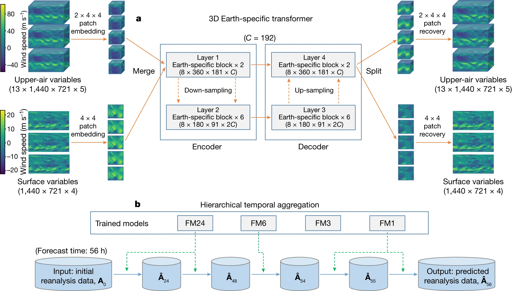

# WeatherLearn
<div align="center">

</div>
Implementation of the PyTorch version of the Weather Deep Learning Model Zoo.

## Dependencies
```
python = "^3.11"
torch = "2.1.0"
timm = "0.9.10"
numpy = "1.23.5"
```

## Model-zoo
### Pangu-Weather
#### Model Architecture

#### Example
```python
from WeatherLearn.models import Pangu

import torch


if __name__ == '__main__':
    B = 1  # batch_size
    surface = torch.randn(B, 4, 721, 1440)  # B, C, Lat, Lon
    surface_mask = torch.randn(3, 721, 1440)  # topography mask, land-sea mask, soil-type mask
    upper_air = torch.randn(B, 5, 13, 721, 1440)  # B, C, Pl, Lat, Lon
    
    pangu_weather = Pangu()
    
    output_surface, output_upper_air = pangu_weather(surface, surface_mask, upper_air)
```
#### References
```
@article{bi2023accurate,
  title={Accurate medium-range global weather forecasting with 3D neural networks},
  author={Bi, Kaifeng and Xie, Lingxi and Zhang, Hengheng and Chen, Xin and Gu, Xiaotao and Tian, Qi},
  journal={Nature},
  volume={619},
  number={7970},
  pages={533--538},
  year={2023},
  publisher={Nature Publishing Group}
}
```
```
@article{bi2022pangu,
  title={Pangu-Weather: A 3D High-Resolution Model for Fast and Accurate Global Weather Forecast},
  author={Bi, Kaifeng and Xie, Lingxi and Zhang, Hengheng and Chen, Xin and Gu, Xiaotao and Tian, Qi},
  journal={arXiv preprint arXiv:2211.02556},
  year={2022}
}
```

## License
[BY-NC-SA 4.0 license](https://creativecommons.org/licenses/by-nc-sa/4.0/)

## TODO
